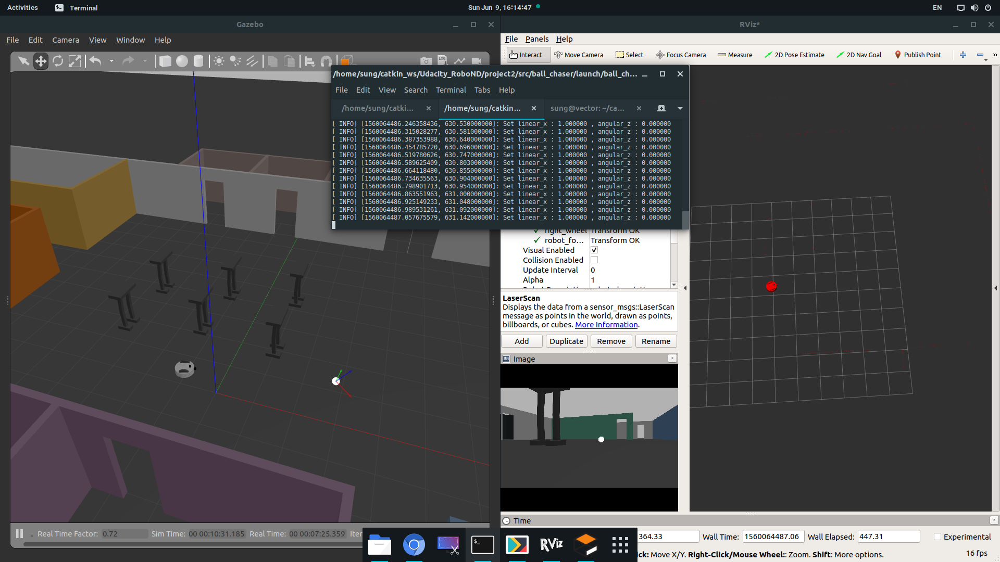

# Udacity NanoDegree - Robotics Software Engineer 
Projects for Robotics Software Engineer NanoDegree Course in Udacity Inc. 

## Project 1. Build My World
- Design a Gazebo World environment by including multiple models

## Project 2. Go Chase It!
- How to make a URDF robot model
- Then program robot with C++ nodes in ROS to chase a white colored ball

## Project 3. Where Am I?
- How to localize robot using Adaptive Monte Carlo Localization(AMCL)

## Project 4. Map My World
- How to simulate Simultaneous Localization and Mapping(SLAM) algorithm using RTAB-Map Package

## Project 5. Map My World
- Program a home service robot that will autonomously map an environment and navigate to pickup and deliver objects

