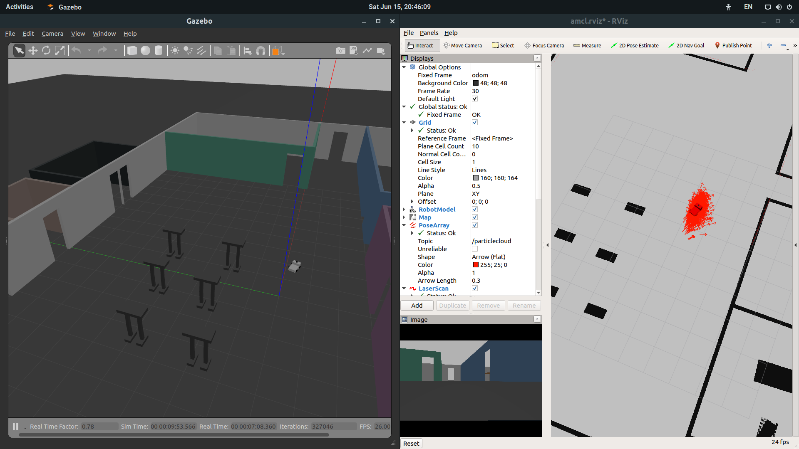

## Project 3. Where Am I?

### Project Aspect
- `drive_bot`
   - Create a `my_robot` ROS package
   - Design a differential drive robot with the Unified Robot Description Format
   - Add two sensors to my robot : `Camera`, `LIDAR`
- `world`
   - Which is created in `project 1` and `project 2`

### Directory Structure
```
    .Project3                                 # Where Am I Project
    ├── my_robot                              # my_robot package                   
    │   ├── config                            # AMCL configuration files   
    │   │   ├── base_local_planner_params.yaml
    │   │   ├── costmap_common_params.yaml
    │   │   ├── global_costmap_params.yaml
    │   │   ├── local_costmap_params.yaml
    │   ├── launch                            # launch folder for launch files   
    │   │   ├── amcl.launch                   # Adaptive MCL launch file
    │   │   ├── robot_description.launch
    │   │   ├── world.launch
    │   ├── maps                              # map folder made 
    │   │   ├── jin_world_map.pgm
    │   │   ├── jin_world_map.yaml
    │   ├── meshes                            # meshes folder for sensors
    │   │   ├── hokuyo.dae
    │   ├── urdf                              # urdf folder for xarco files
    │   │   ├── my_robot.gazebo               # my robot model
    │   │   ├── my_robot.xacro                # my robot model
    │   ├── worlds                            # world folder for world file
    │   │   ├── jin.world
    │   ├── CMakeLists.txt                    # compiler instructions
    │   ├── package.xml                       # package info
    ├── teleop_twist_keyboard                 # teleop_twist_keyboard package                   
    └── amcl.rviz                             # rviz presets      
```

### Steps to launch the simulation
#### Step 1 Update and upgrade the Workspace image
```sh
$ sudo apt-get update
$ sudo apt-get upgrade -y
```

#### Step 2 Clone the lab folder in /home/workspace/
```sh
$ cd /home/workspace/
$ git clone https://github.com/samchiRobot/UND_Robo/
```

#### Step 3 Compile the code by catkin
```sh
$ cd /home/workspace/project3/
$ catkin_make
```

#### Step 4 Launch the robot inside my world
```sh
$ cd /home/workspace/project3/
$ source devel/setup.bash
$ roslaunch my_robot world.launch
```

#### Step 5 Run the `amcl` node

Open new terminal

```sh
$ cd /home/workspace/project3/
$ source devel/setup.bash
$ roslaunch my_robot amcl.launch
```
#### Step 6 Run teleop_twist_keyboard

Open new terminal

```sh
$ cd /home/workspace/project3/
$ source devel/setup.bash
$ rosrun teleop_twist_keyboard teleop_twist_keyboard.py
```


### Output
My program should both launch as follow

