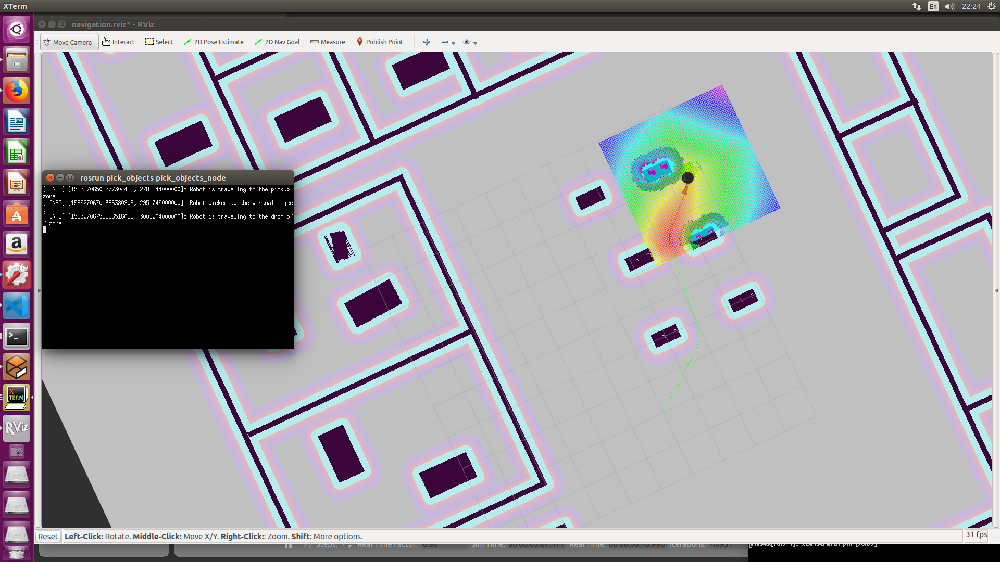
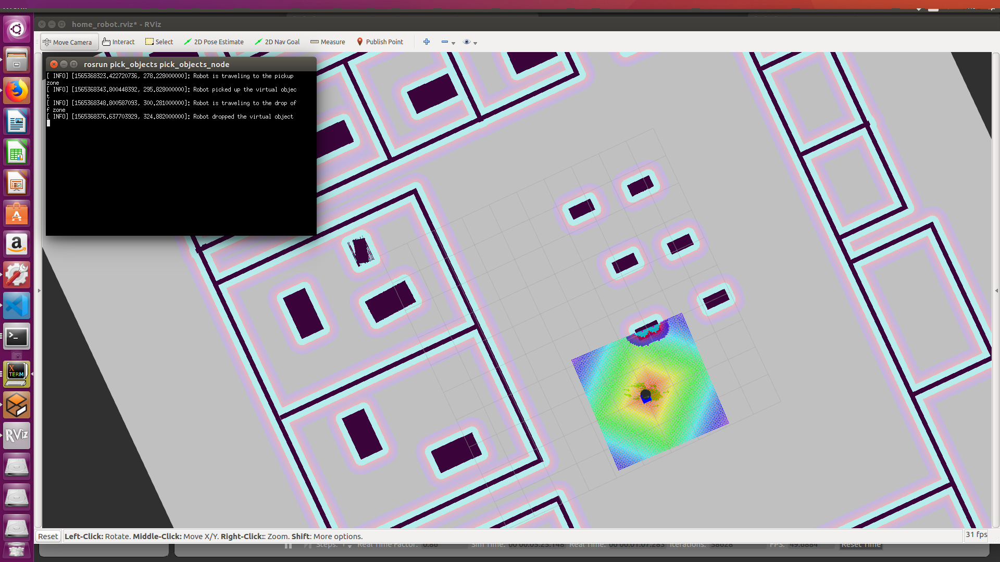
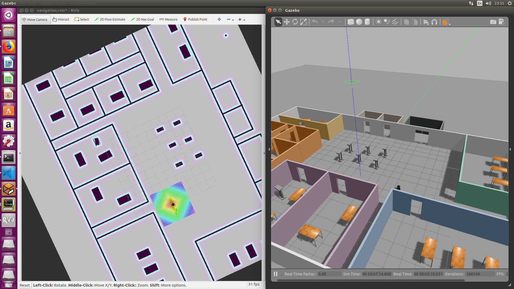

## Project 5. Home Service Robot

### Prerequisites
- ROS : Kinetic (turtlebot, kobuki not support melodic)
- Ubuntu : 16.04 (for ROS Kinetic)

```
sudo apt install xterm
sudo apt install ros-kinetic-turtlebot
sudo apt install ros-kinetic-turtlebot-*
sudo apt install ros-kinetic-openslam-gmapping
sudo apt install ros-kinetic-teleop-*
sudo apt install ros-kinetic-amcl
sudo apt install ros-kinetic-move-base
sudo apt install ros-kinetic-map-server
```

### Project Aspect
- `add_markers`
   - Add a marker assumed to be an object
      - Phase 1. Create Marker at Destination 1
      - Phase 2. Delete Objects
      - Phase 3. Create Marker at Destination 2
   - Nodes are created separately according to the `.sh` file using this package 
- `pick_objects`
   - Robot Teleoperation algorithm for Two Destinations
- `scripts`
   - To launch multiple roslaunch command and set the params
      - `launch.sh` : shell script test program
      - `add_marker.sh` : marker test program (If you want to test this shell script, you need to modify add_markers copy.cpp in add_marker package to add_markers.cpp)
      
      - `pick_objects.sh` : teleoperation test program
      
      - `home_service.sh` : main program
      
      - `test_navigation.sh` : amcl test program
      
      - `test_slam.sh` : gmapping test program
      
   
### Directory Structure
```
    .Project5                                 # Home Service Robot Project
    ├── add_markers                           # add_markers package                   
    │   ├── launch                            # launch folder for launch files   
    │   │   ├── home_robot.rviz               # rviz preset for home_service.sh
    │   │   ├── set_goal.launch               # launch file for home_service.sh
    │   ├── src                            
    │   │   ├── add_markers_robot.cpp          # marker test code (for home_service.sh)
    │   │   ├── add_markers.cpp               # marker test code (for add_marker.sh)
    │   ├── CMakeLists.txt                    # compiler instructions
    │   ├── package.xml                       # package info
    ├── map                                   # gazebo world file + pgm file                   
    │   ├── empty.world                       # test world file   
    │   ├── jin.world                         # my gazebo world file   
    │   ├── jin_world_map.pgm                 # my gazebo map file   
    │   ├── jin_world_map.yaml                # my gazebo map preset   
    ├── pick_objects                          # robot teleoperation package                   
    │   ├── src
    │   │   ├── pick_objects.cpp              # teleoperation test code
    │   ├── CMakeLists.txt                    # compiler instructions
    │   ├── package.xml                       # package info
    ├── scripts                               # shell script files                   
    │   │   ├── add_marker.sh
    │   │   ├── home_service.sh
    │   │   ├── launch.sh
    │   │   ├── pick_objects.sh
    │   │   ├── test_navigation.sh
    │   │   ├── test_slam.sh
    ├── slam_gmapping                        # SLAM package                   
    ├── turtlebot                            # turtlebot package (for teleop)                  
    ├── turtlebot_apps                       # teleop_twist_keyboard package                   
    ├── turtlebot_interactions               # for turtlebot_rviz_launchers                  
    ├── turtlebot_msgs                       # prerequisites                   
    └── turtlebot_simulator                  # for turtlebot_gazebo
```

### Steps to launch the simulation
#### Step 1 Update and upgrade the Workspace image
```sh
$ sudo apt-get update
$ sudo apt-get upgrade -y
```

#### Step 2 Clone the lab folder in ~/catkin_ws
```sh
$ mkdir ~/catkin_ws
$ cd ~/catkin_ws
$ git clone https://github.com/samchiRobot/UND_Robotics/
```

#### Step 3 Compile the code by catkin
```sh
$ cd ~/catkin_ws/UND_Robotics/project5/
$ catkin_make
```

#### Step 4 Launch the robot inside my world
```sh
$ cd ~/catkin_ws/UND_Robotics/project5/
$ source devel/setup.bash
```

#### Step 5 Launch shell script file
```sh
$ cd ~/catkin_ws/UND_Robotics/project5/src/scripts
$ ./home_service.sh
```

## How to solve the problem

### kobuki_description issue

```sh
sudo apt-get remove turtlebot-*
sudo apt-get remove kobuki-*
sudo apt-get install ros-kinetic-turtlebot
```

